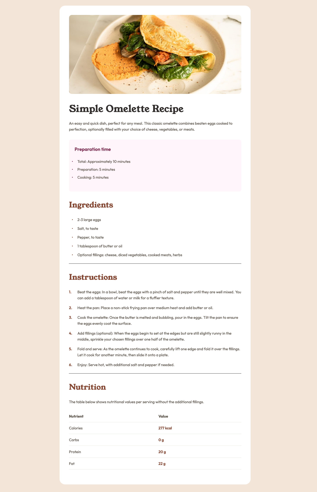

# Frontend Mentor - Recipe page solution

This is a solution to the [Recipe page challenge on Frontend Mentor](https://www.frontendmentor.io/challenges/recipe-page-KiTsR8QQKm). Frontend Mentor challenges help you improve your coding skills by building realistic projects.

## Table of contents

- [Overview](#overview)
  - [The challenge](#the-challenge)
  - [Screenshot](#screenshot)
  - [Links](#links)
- [My process](#my-process)
  - [Built with](#built-with)
  - [What I learned](#what-i-learned)
  - [Continued development](#continued-development)
  - [Useful resources](#useful-resources)
- [Author](#author)
- [Acknowledgments](#acknowledgments)

**Note: Delete this note and update the table of contents based on what sections you keep.**

## Overview

### Screenshot



### Links

- [Solution URL here](https://github.com/lgwarda/recipe-page.git)
- [Live site URL here](https://lgwarda.github.io/recipe-page/)

## My process

### Built with

- Semantic HTML5 markup
- CSS custom properties
- Mobile-first workflow

### What I learned

1. The rule `td:last-child` targets the last td element in each row, applying the var `(--brown-800)` color only to the numerical values.

```css
/* Table Styles */
table {
  width: 100%;
  border-collapse: collapse;
  margin-top: 20px;
}

th,
td {
  border-bottom: 1px solid var(--stone-150);
  padding: 10px;
  text-align: left;
}

th {
  background-color: var(--stone-150);
}

/* Set color for only the numerical values in the last column */
td:last-child {
  color: var(--brown-800); /* Match the h2 color */
}
```

2. List Styling:

- Used ::before pseudo-elements for better control of bullet points and numbers
- Implemented custom counter for numbered list
- Maintained consistent spacing and alignment

```css
/* Lists */
ul {
    padding-left: 24px;
    margin: 24px 0;
    list-style: none;
}

ul li {
    margin-bottom: 12px;
    padding-left: 12px;
    position: relative;
    color: var(--stone-600);
}

ul li::before {
    content: "•";
    color: var(--brown-800);
    position: absolute;
    left: -12px;
```

### Continued development

Here’s a structured way to outline areas for continued development, focusing on performance and alignment with design specifications:

### Continued Development Focus Areas

1. **Performance Optimization**

   - **Image Optimization**: Implement advanced techniques for image compression and lazy loading to reduce initial load times and improve performance on various devices.

2. **Alignment with Design Specifications**

   - **Responsive Design Implementation**: Continue refining CSS and layout techniques to ensure components are fully responsive across all screen sizes, adhering to design mockups.

3. **Performance Monitoring and Analysis**

   - **Use Performance Monitoring Tools**: Integrate tools like Google Lighthouse, WebPageTest, or GTmetrix to continually assess and monitor site performance.

4. **Ongoing Learning and Adaptation**
   - **Stay Updated on Best Practices**: Keep abreast of the latest performance optimization techniques and design trends by following industry blogs, attending workshops, or participating in webinars.
   - **Iterative Development**: Adopt an agile approach to development, allowing for regular reviews and iterations based on performance metrics and design alignment.

### Useful resources

- [Example resource 1](https://www.example.com) - This helped me for XYZ reason. I really liked this pattern and will use it going forward.
- [Example resource 2](https://www.example.com) - This is an amazing article which helped me finally understand XYZ. I'd recommend it to anyone still learning this concept.

## Author

- Frontend Mentor - [@lgwarda](https://www.frontendmentor.io/profile/lgwarda)

## Acknowledgments

I would like to thank Frontend Mentor for this challenge and everyone who provided feedback. Your support has been invaluable.
